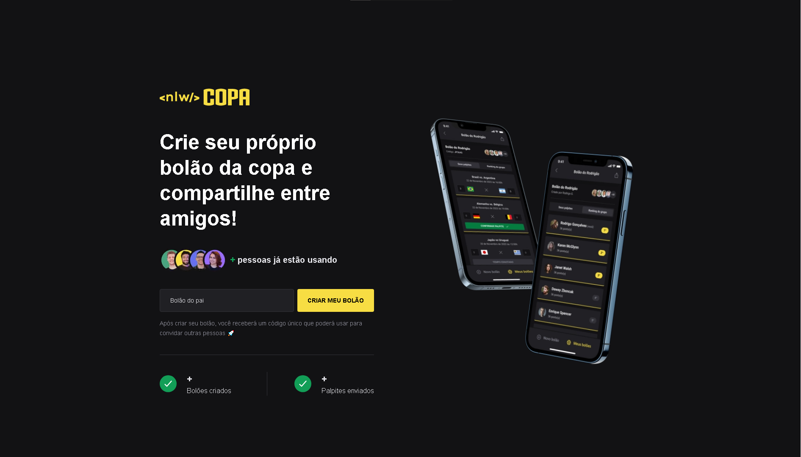
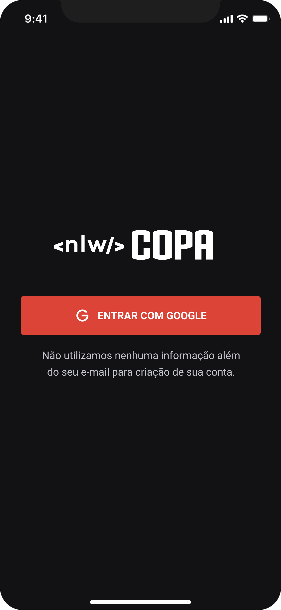
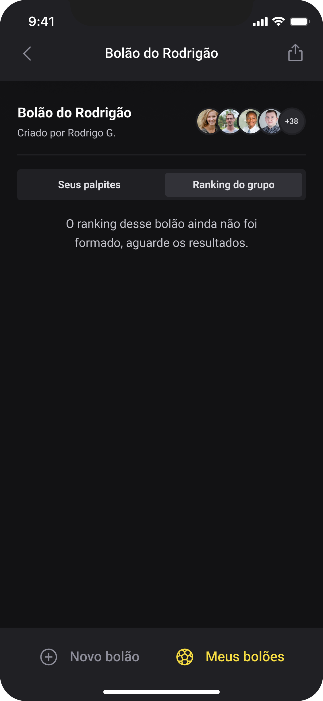
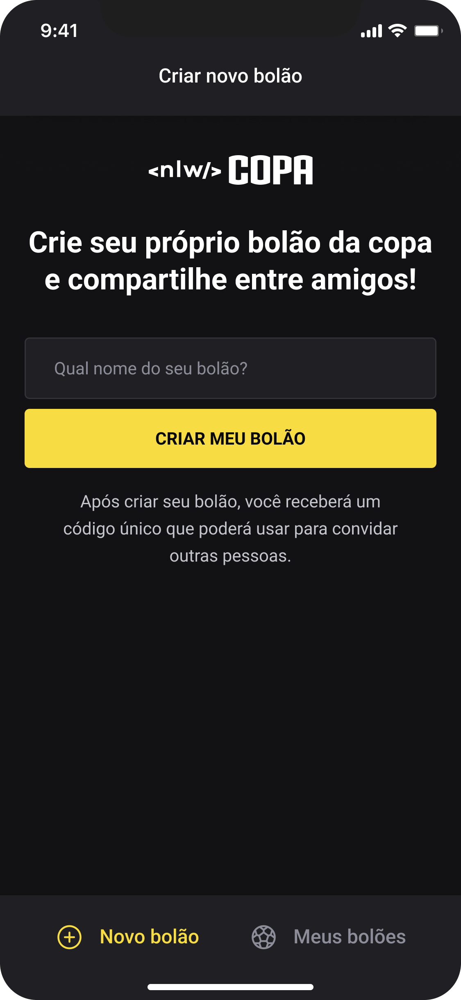

  

  
  

## ✨ Tecnologia

- [TypeScript](https://www.typescriptlang.org/)
- [React](https://reactjs.org/)
- [React Native](https://reactnative.dev/)
- [Expo](https://expo.dev/)
- [Fastify](https://www.fastify.io/)
- [Prisma](https://www.prisma.io/)
- E muitas outras…

## 💻 Projeto

This is an application made by me, with Rocktseat code, with the objective of improving reign and learn more about Web development

  
  
  

## 🔖 Layout

Você pode visualizar o layout do projeto através do link abaixo:

- [Layout](https://www.figma.com/community/file/1169028343875283461)

Lembrando que você precisa ter uma conta no [Figma](http://figma.com/).

<h1 align="center">
  Isaac Moretão
</h1>

  I'm a Programming Student focused on ReactJs, I'm looking for my first job 
  as a programmer in the job market, you can see other projects of mine, on my GitHub profile,
  if you give me a star in this repository I would be very grateful, and if you can comment what you think you help me improve

## 📝 License

Esse projeto está sob a licença MIT. Veja o arquivo [LICENSE](LICENSE) para mais detalhes.

---